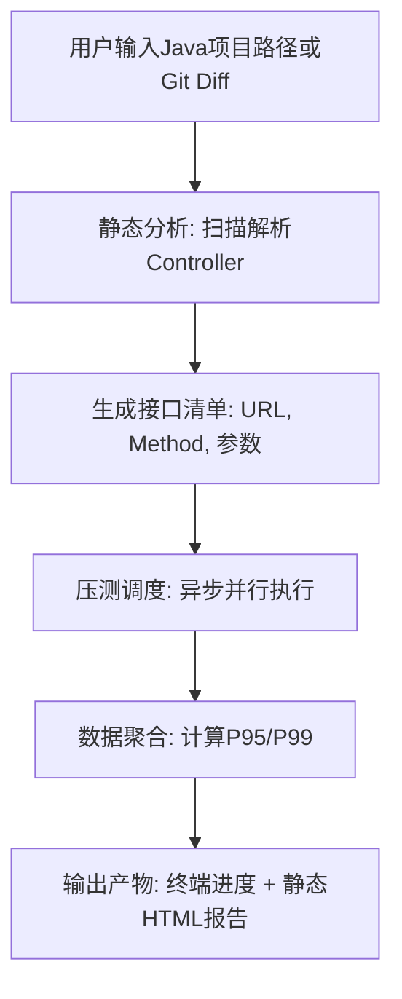

# 项目需求说明书：智能 API 压力测试与排名工具 (PerfScanner)

## 1. 项目背景与目标
开发一款本地化的 CLI 压测工具，旨在解决微服务/Java 项目中接口性能盲区问题。

- **核心痛点**：开发者对核心接口性能“心里有数”，但无法感知**并发劣化**、**人员流动带来的技术债**以及**依赖中间件抖动导致的集体衰退**。
- **核心目标**：自动扫描 Java 项目（Controller 层），全量/增量执行压力测试，输出 **P95/P99** 数据，并生成**从慢到快**的接口排名，作为重构优先级和上线门禁的依据。

## 2. 核心工作流 (MVP 流程)



## 3. 详细技术方案与选型

### 3.1 静态分析（Java 项目解析）
- **需求**：读取用户项目文件夹，自动识别 Spring Boot 注解（`@GetMapping`, `@PostMapping`, `@RequestMapping` 等）。
- **技术选型**：`javalang` (纯 Python 的 AST 解析器)。
- **实现逻辑**：遍历 `.java` 文件 -> 构建 AST -> 提取类级 `@RequestMapping` 路径 -> 提取方法级路径与 HTTP Method -> 拼接为完整 URL。
- *注意：需处理 `@PathVariable` 路径变量（可用 `{id}` 或随机值代替）。*

### 3.2 动态压测引擎
- **需求**：对发现的接口发起并发请求，收集响应时间。
- **技术选型**：`aiohttp` + `asyncio`。
- **核心约束**：**必须复用 `ClientSession`** 以减少连接开销。

### 3.3 大规模接口优化策略（解决“测太久”问题）
当扫描出数百个接口时，采用 **两阶段（漏斗）测试法**：

1.  **快速扫描（第一阶段）**：
    - 对**所有**接口发送少量请求（如 30~50 个）。
    - 快速计算粗略 P95，初步排序。
2.  **深度测试（第二阶段）**：
    - 仅针对排名后 **Top 20%**（或用户指定数量）的慢接口进行足量压测（如 2000~5000 请求）。
    - 获取精确的 P95/P99。
3.  **并行控制**：
    - 使用 `asyncio.Semaphore` 控制同时压测的接口数量（默认 5~10 个），防止打崩目标服务器。

### 3.4 数据指标与排序
- **核心指标**：P95（保证 95% 的用户体验）、P99（极端情况）、平均响应时间、最大并发数、成功率。
- **排序规则**：按 **P95** 降序排列（最慢的排最前面）。

## 4. 产品交互形态（关键决策）

**最终形态：CLI 驱动 + 静态 HTML 报告生成（拒绝重型 Web 后端）**

| 交互模块 | 实现方式 | 理由 |
| :--- | :--- | :--- |
| **命令执行** | CLI (`click`/`argparse`) | 便于嵌入 CI/CD（Jenkins/GitLab CI）、资源占用极低。 |
| **实时进度** | 终端 `rich` 进度条 | 展示当前测试接口、进度百分比、实时 P95。 |
| **结果查看** | 自动生成 `report.html` | **避免本地 Web 服务器抢占 CPU 导致压测失真**；双击即可用浏览器打开，包含 Chart.js 绘制的排序图和搜索功能。 |

### 4.1 命令示例
```bash
# 全量扫描
perf-tool start ./spring-boot-project -c 50 -n 2000

# 增量扫描（配合 Git）
perf-tool start ./spring-boot-project --git-diff main..HEAD
```

## 5. 核心参数配置（CLI 选项）

工具必须暴露以下可调参数，以平衡速度与精度：

| 参数名 | 类型 | 默认值 | 说明 |
| :--- | :--- | :--- | :--- |
| `--max-parallel` | int | 5 | 同时压测的接口数量（保护目标服务器）。 |
| `--quick-requests` | int | 50 | 第一阶段每个接口的请求数。 |
| `--deep-requests` | int | 2000 | 第二阶段（慢接口）每个接口的请求数。 |
| `--deep-threshold` | int/float | 20 | 进入第二阶段的接口数量（如 Top 20）。 |
| `--timeout` | int | 30 | 单次请求超时时间（秒）。 |

## 6. 输出产物设计

### 6.1 数据中间层 (JSON)
压测完成后，数据聚合为 JSON 文件（如 `report_data.json`），包含所有接口的元数据和指标。

### 6.2 静态 HTML 报告
- **技术栈**：`Jinja2` 模板 + `Chart.js` (CDN)。
- **功能要求**：
    1.  总览卡片（总接口数、最慢接口、平均 P95）。
    2.  柱状图（X轴：接口名，Y轴：P95 响应时间）。
    3.  可搜索/排序的表格（列：排名、HTTP方法、URL、P95、P99、状态）。

## 7. 技术栈总览 (Requirements.txt)

```text
aiohttp>=3.9.0          # 异步 HTTP 客户端
javalang>=0.13.0        # Java 源码解析
click>=8.1.0            # CLI 交互框架
rich>=13.7.0            # 终端美化与进度条
jinja2>=3.1.0           # HTML 模板渲染
numpy>=1.24.0           # 百分位数快速计算 (或使用 statistics 标准库)
```

## 8. 架构分层与模块划分 (AI Coding 参考)

- **`scanner/`**：Java 项目扫描模块。负责文件遍历与 AST 解析，输出标准化 `Endpoint` 对象列表。
- **`engine/`**：压测核心引擎。接收 Endpoint 列表，利用 `asyncio` 调度并发请求，处理超时与重试，返回原始响应时间列表。
- **`analyzer/`**：数据分析模块。计算 P95/P99，执行两阶段筛选逻辑，生成排序后的字典数据。
- **`reporter/`**：报告输出模块。负责将数据写入 JSON 并渲染 HTML。
- **`cli/`**：用户交互入口。解析命令参数，串联整个流程（Scan -> Test -> Report -> Open Browser）。

## 9. 关键约束与注意事项

1.  **资源隔离**：严禁使用 Flask/FastAPI 启动 Web 服务来承载压测，必须直接运行 CLI 脚本以保持 CPU 全部分配给压测协程。
2.  **依赖处理**：`javalang` 对 Java 8+ 泛型/注解支持良好，但对 Java 17+ 极其新语法（如 Record）可能报错，需在解析时增加异常捕获，跳过无法解析的文件。
3.  **压测流量标识**：建议在请求头中加入 `X-Perf-Test: True`，便于目标服务熔断或降级策略识别并放行测试流量。
4.  **服务器保护**：若目标服务器出现大量 5xx 或超时，应自动降低 `--max-parallel` 或暂停施压。
