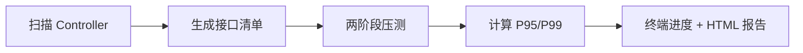

# `dagger scan` — Java 接口扫描压测与排名

> 对应 PerfScanner：自动扫描 Java 项目（Spring Boot Controller 层），全量/增量执行压力测试，输出 **P95/P99**，生成**从慢到快**的接口排名，作为重构优先级与上线门禁依据。

## 核心痛点

开发者对单个接口性能“心里有数”，却难以感知：**并发劣化**、**人员流动带来的技术债**、**依赖中间件抖动导致的集体衰退**。`dagger scan` 一次性扫描项目全部 Controller 接口并统一压测，暴露最慢的接口。

## 工作流



## 命令格式

```bash
dagger scan <PROJECT> --base-url <URL> [选项]
```

### 参数

| 参数 | 默认 | 说明 |
| :--- | :--- | :--- |
| `PROJECT`（位置参数） | — | Java 项目目录路径 |
| `-b, --base-url URL` | **必填** | 目标服务器基础地址，须含协议/主机/端口（及 context-path） |
| `--git-diff RANGE` | — | 增量扫描的 git 范围，如 `main..HEAD` |
| `-c, --max-parallel N` | `5` | 同时压测的接口数量（保护目标服务器） |
| `--quick-requests N` | `50` | 第一阶段每个接口的请求数 |
| `-n, --deep-requests N` | `2000` | 第二阶段（慢接口）每个接口的请求数 |
| `--deep-threshold N` | `20` | 进入第二阶段的接口数（整数）或比例（0~1 小数） |
| `-t, --timeout SECONDS` | `30` | 单次请求超时（秒） |
| `--max-retries N` | `3` | 请求失败（传输错误/超时）的最大重试次数 |
| `--drop-failure-rate RATE` | `0.5` | 失败率达到该阈值（0~1）后丢弃此接口；设为 >1 禁用丢弃 |
| `--min-requests-before-drop N` | `10` | 至少完成多少请求后才允许触发丢弃 |
| `-o, --output DIR` | `./perf_results` | 输出目录 |
| `--open` | `false` | 报告生成后自动在浏览器打开 |

### `--base-url` 说明

> **必须由用户显式指定**目标服务器的协议、主机、端口（以及 context-path）。工具**不会**自动解析项目配置文件中的 `server.port` 或 `context-path`。

例如 Spring Boot 配置 `server.port: 8101`、`context-path: /api` 时，应传：

```bash
dagger scan ./glow --base-url http://localhost:8101/api
```

---

## 示例

### 1. 全量扫描

```bash
dagger scan ./spring-boot-project --base-url http://localhost:8080
```

### 2. 增量扫描（配合 Git）

```bash
# 仅扫描 main..HEAD 之间变更的 .java 文件
dagger scan ./spring-boot-project --base-url http://localhost:8080 --git-diff main..HEAD
```

### 3. 自定义压测规模

```bash
# 10 个接口并行；快扫 30 次/接口；慢接口深测 5000 次；Top 20 慢接口进深测
dagger scan ./project --base-url http://localhost:8080/api \
  -c 10 --quick-requests 30 -n 5000 --deep-threshold 20 -t 60
```

### 4. `--deep-threshold` 两种用法

```bash
--deep-threshold 20     # Top 20 个慢接口
--deep-threshold 0.2    # Top 20%（最慢的 20% 接口）
```

---

## 静态扫描能力

- 识别 `@RestController` / `@Controller` 及其方法级注解：`@GetMapping`、`@PostMapping`、`@PutMapping`、`@DeleteMapping`、`@PatchMapping`、`@RequestMapping(method=...)`。
- 拼接类级 `@RequestMapping` 前缀 + 方法级路径为完整 URL。
- 处理 `@PathVariable`：`{id}` 替换为占位值（数值类型 → `1`，字符串 → `test`）。
- 支持数组路径（如 `@DeleteMapping({"/a","/b"})`）。
- 跳过非 Controller 类，以及无法解析的文件（如 Java 17+ `record` 语法），不中断扫描。

> 说明：`@RequestParam` / `@RequestBody` 的**具体取值**不会被自动生成（静态扫描无法得知合法业务值），因此带必填参数的接口在压测中可能返回 4xx，成功率会如实记录。这是静态扫描的固有限制。

---

## 两阶段（漏斗）压测

解决“数百个接口逐个深测太慢”的问题：

1. **快速扫描（阶段一）**：对**所有**接口各发少量请求（默认 50），计算粗略 P95，初步排序。
2. **深度测试（阶段二）**：仅对排名 **Top N** 的慢接口足量压测（默认 2000），获取精确 P95/P99。
3. **并行控制**：`asyncio.Semaphore` 限制同时压测的接口数（默认 5），防止打崩目标。

## 输出产物

| 文件 | 说明 |
| :--- | :--- |
| `report_data.json` | 全部接口元数据与指标（机器可读） |
| `report.html` | 静态 HTML 报告：总览卡片 + P95 柱状图 + 可搜索/排序表格 |

HTML 报告无需本地 Web 服务器，双击即可用浏览器打开（Chart.js 走 CDN）。

## 关键设计约束

1. **无 Web 后端**：直接运行 CLI，CPU 全部分配给压测协程。
2. **连接复用**：全程复用单个 `aiohttp.ClientSession`。
3. **流量标识**：请求头自动携带 `X-Perf-Test: True`，便于目标服务熔断/降级识别测试流量。
4. **服务器保护**：连续多个接口失败率 ≥ 50%（含 5xx/超时）时，自动减半单接口并发。
5. **失败请求分层统计**：P95/P99 仅由**成功请求**计算，失败请求（4xx/5xx/超时）计入错误率，工具自身错误（连接被拒等）剔除。详见 [压测失败请求处理策略](strategy.md)。

## 排名示例

```text
接口性能排行 (按成功请求 P95 从慢到快)
┌──────┬──────┬────────────────┬──────────┬──────────┬────────┬────────┬──────┐
│ 排名 │ 方法 │ 路径           │ P95 (ms) │ P99 (ms) │ 成功率 │ 错误率 │ 质量 │
├──────┼──────┼────────────────┼──────────┼──────────┼────────┼────────┼──────┤
│    1 │ POST │ /user/register │  3016.24 │  3016.44 │   2.1% │  97.9% │  🔴  │
│    2 │ GET  │ /info          │  1012.50 │  1030.10 │ 100.0% │   0.0% │  🟢  │
│    3 │ POST │ /post/list     │    21.16 │    21.49 │  99.8% │   0.2% │  🟢  │
│  ... │ ...  │ ...            │      ... │      ... │    ... │    ... │  ... │
└──────┴──────┴────────────────┴──────────┴──────────┴────────┴────────┴──────┘
```

> 说明：无成功请求的接口 P95/P99 显示为 `N/A` 并排在最前（故障优先暴露）；错误率是独立于延迟的一等指标。统计口径见 [strategy.md](strategy.md)。
